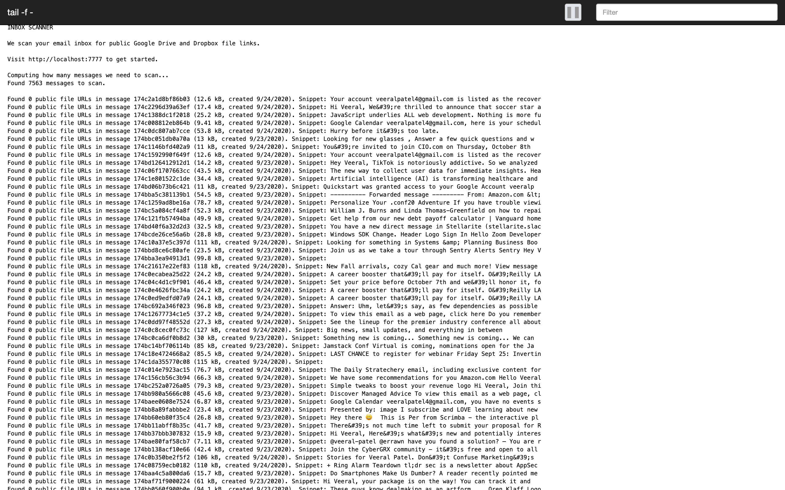

# Inbox Scanner

[](https://gitHub.com/veeral-patel/inbox-scanner/issues/) [](https://gitHub.com/veeral-patel/inbox-scanner/issues?q=is%3Aissue+is%3Aclosed)

Scans a Gmail inbox for public Dropbox and Google Drive file links. Written using Node.js and Typescript.



## To run the scanner

### Clone repository and install dependencies

```
git clone http://github.com/veeral-patel/inbox-scanner && cd inbox-scanner
yarn install
```

### Create an OAuth app

Next, we need to create an OAuth app so this program can access your inbox.

1. Visit [this URL](https://developers.google.com/gmail/api/quickstart/nodejs) and click "Enable the Gmail API" under Step 1.

2. Select "Web server" on the "Configure your OAuth client" page" and enter
   `http://localhost:7777/callback` under "Authorized redirect URIs".

3. Then, in the next step in the wizard, click "Download Client Configuration". Save this file as credentials.json in
   your `inbox-scanner` folder.

### Build and run our program

```
# Compiles our (TypeScript) code into JS code we can run.
yarn build

yarn start
```

Now, open `http://localhost:9001` and follow the instructions there.

## Run all (unit) tests with:

```
yarn build
yarn test
```
